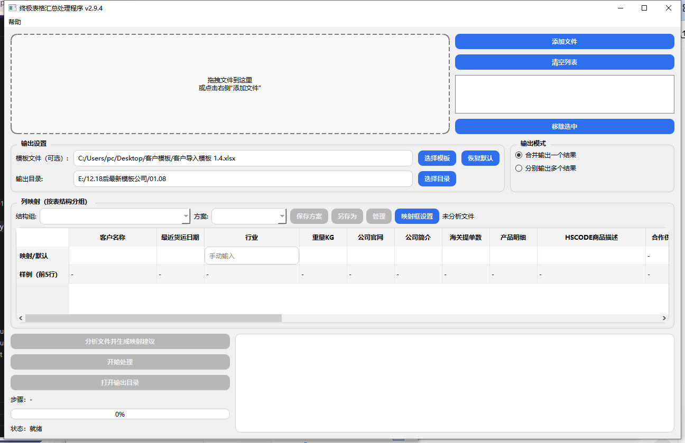
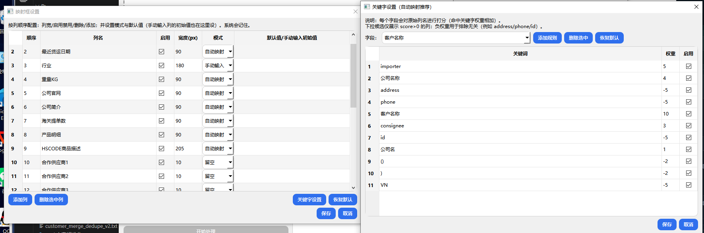
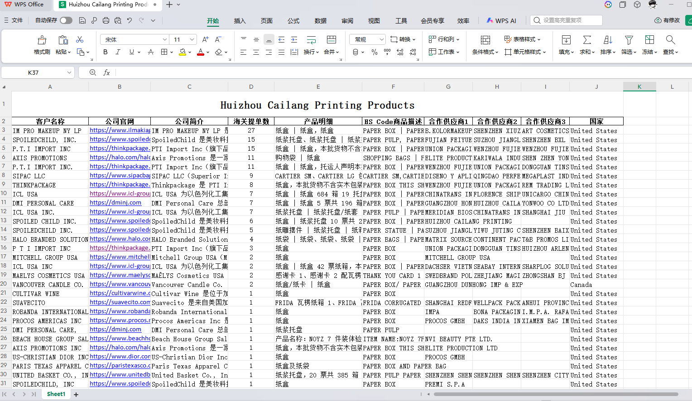
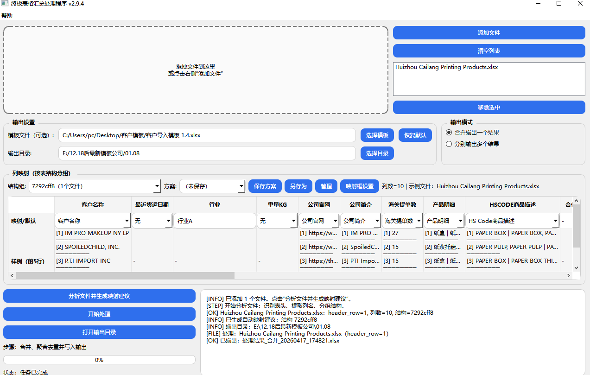
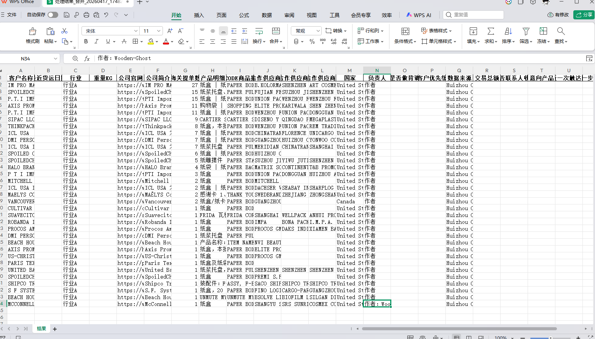

# excel-schema-mapper
Excel Schema Mapper｜多来源表格自动识别与映射处理工具
# Excel Schema Mapper

多来源表格自动识别与映射处理工具

> A desktop tool for automatically detecting, mapping, and standardizing tabular data from multiple Excel/CSV sources.




## 项目简介

这个项目用于处理**来源不同、表头不同、版式不同**的 Excel / CSV 表格，并将它们整理为统一结构的输出结果。

它适合这样的场景：

- 不同来源文件的字段命名不一致
- 表头位置不固定，原始表格格式混乱
- 需要将多个原始表整理到同一套标准字段中
- 同类结构文件需要重复处理，希望保存映射方案并复用

相比手工整理，这个工具更适合重复性、高频率、规则相对稳定的数据处理工作。

---

## 项目亮点

- **自动识别表头**
  - 自动扫描原始表格，判断更可能的表头行，减少手动清洗成本

- **适配不同结构源表**
  - 即使两个源文件的表头名称、字段顺序、版式明显不同，也可以分别建立映射后输出为统一结果

- **自动字段推荐**
  - 根据关键词规则对原始列进行打分，自动给出候选映射列

- **按表结构分组处理**
  - 程序会按表结构自动分组，不同结构分别配置映射，避免混乱

- **映射方案可保存复用**
  - 支持保存、另存为、管理映射方案，适合重复处理同类结构文件

- **输出字段可配置**
  - 支持启用/禁用列、调整列顺序、设置默认值、切换自动映射/手动输入/固定默认/留空模式

- **支持模板输出**
  - 可选加载模板文件，按目标字段结构输出结果

- **支持两种输出模式**
  - 合并输出一个结果
  - 分别输出多个结果

---

## 演示样例

本仓库包含脱敏后的演示文件，用于展示程序对**不同表头、不同版式原始表格**的适配能力。

### 示例文件

- `sample_data/source_a_raw_different_headers.xlsx`
- `sample_data/source_b_raw_different_layout.xlsx`

### 演示重点

这两个源表不是简单换个名字，而是：

- 表头命名方式不同
- 字段顺序不同
- 版式结构不同

程序会先识别结构，再给出映射建议，最终输出统一字段结构的结果表。






---

## 界面预览

### 主界面

支持拖拽或手动添加文件，设置模板、输出目录和输出模式，并在日志区查看处理过程。


### 列映射界面

程序会按表结构分组展示映射区域，并提供字段候选、样例预览、方案保存等能力。


### 映射框设置 / 关键字设置

可配置输出列、默认值、模式、列宽，并通过关键字规则提升自动推荐效果。


---

## 处理流程

1. 添加原始 Excel / CSV 文件  
2. 点击 **“分析文件并生成映射建议”**  
3. 检查并调整字段映射  
4. 选择输出模式：
   - 合并输出一个结果
   - 分别输出多个结果  
5. 点击 **“开始处理”** 导出标准化结果

---

## 适用场景

- 海关/贸易/供应链类数据汇总
- 多来源客户信息整理
- 需要统一字段口径的表格清洗
- 需要长期重复处理同类结构文件的业务场景

---

## 运行环境

- Python 3.10+
- Windows（当前项目主要以桌面 GUI 工具形式使用）

---

## 运行依赖 / Runtime Dependencies

下面是程序运行所需额外安装的库：  
The following libraries need to be installed before running the program:

- PySide6
- pandas
- openpyxl

安装命令 / Installation command:

```bash
pip install -r requirements.txt
